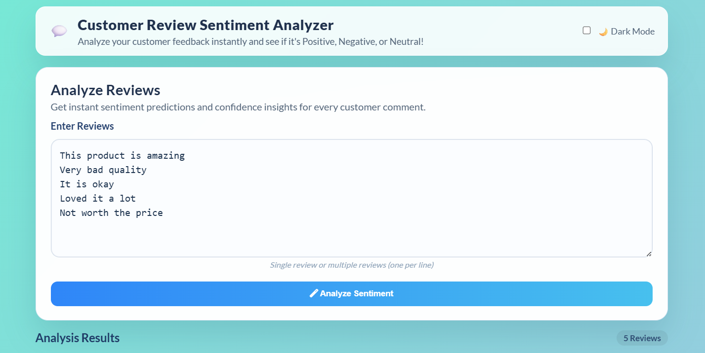
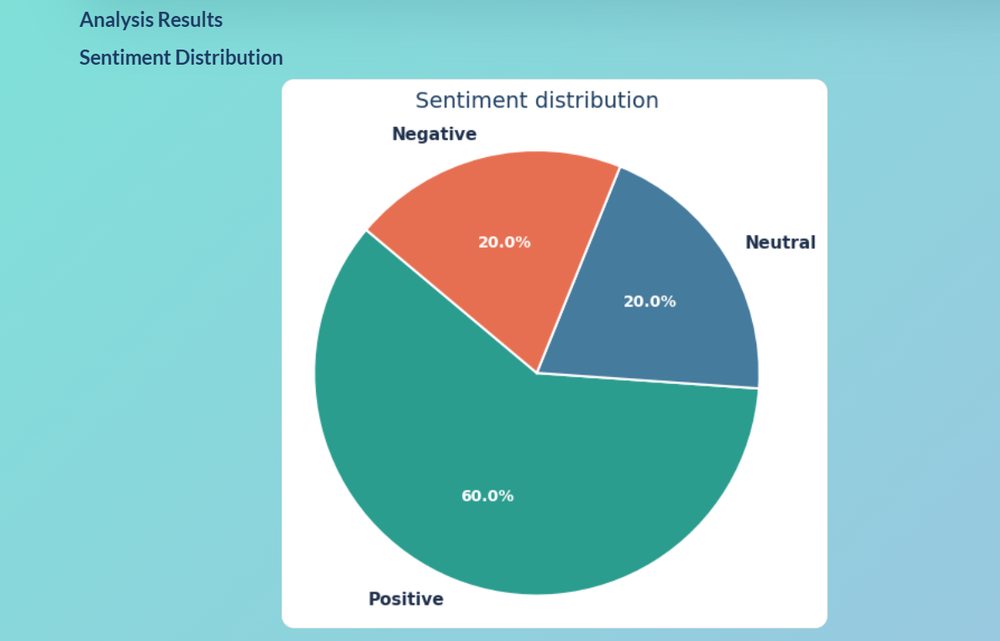
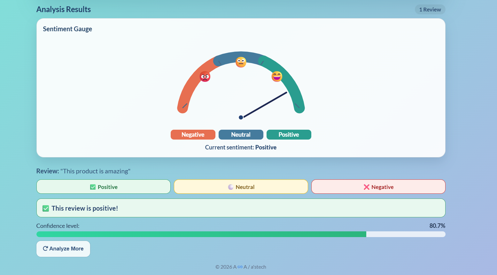
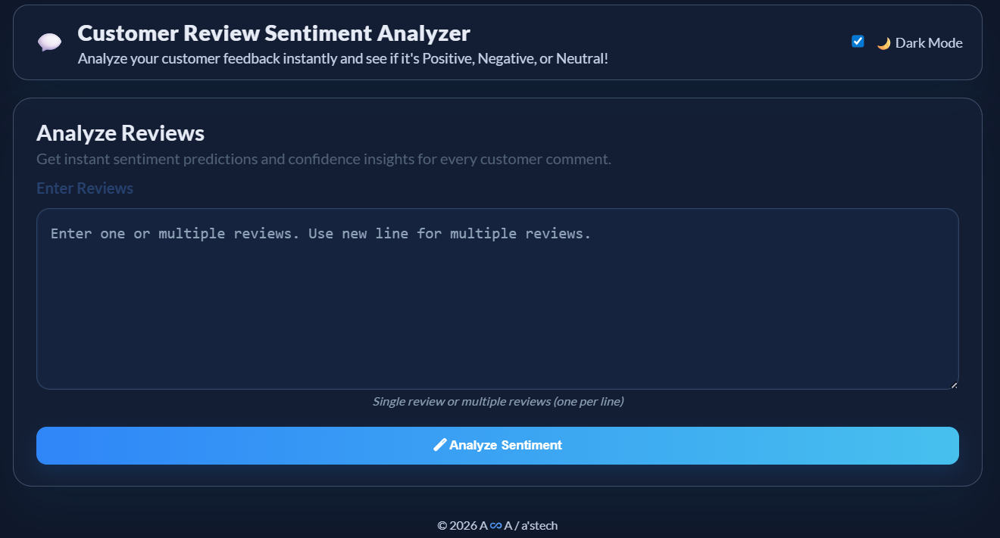

# Customer Review Sentiment Analysis 🌟

This project performs sentiment analysis on customer reviews to predict whether the reviews are **positive**, **negative**, or **neutral**. It uses a machine learning model trained on synthetic data to classify sentiments based on input review text. The system includes a Flask web application with a modern, responsive UI.

## 🚀 Features

- **Synthetic Dataset Generation**: Creates 1500+ labeled reviews (positive, negative, neutral)
- **Text Preprocessing**: Lowercase conversion, punctuation removal, stopword filtering using NLTK
- **Logistic Regression Model**: Trained with TF-IDF vectorization for accurate sentiment classification
- **Flask Web App**: Clean, modern interface with responsive design
- **Confidence Scores**: Shows prediction confidence percentage
- **Bulk Analysis**: Analyze multiple reviews at once with visual charts
- **Dark Mode Toggle**: Modern UI with theme switching capability

## 📸 Project Screenshots

### Home Page


### Prediction Result



### Analysis


### Dashboard


## � Demo Video

[](https://drive.google.com/file/d/12LFeUSM0vlX8w9ej6R0QjUXo4g6w_hM4/view?usp=drive_link)

*Click the image above to watch a demo of the Customer Review Sentiment Analysis application in action!*


## �🎯 Objective

To help businesses analyze customer feedback by automating the sentiment analysis process. This tool can classify product reviews based on their sentiment (positive, negative, or neutral) with high accuracy.

## 📂 Dataset

The model is trained on **synthetic data** generated programmatically, consisting of:
- **500 positive reviews** with words like "amazing", "excellent", "fantastic", etc.
- **500 negative reviews** with words like "terrible", "awful", "horrible", etc.
- **500 neutral reviews** with words like "okay", "fine", "average", etc.

This approach ensures consistent training data without relying on external datasets.

## 💻 Technologies Used

- **Python** 🐍
- **Flask** for web deployment 🖥️
- **NLTK** for natural language processing 🧠
- **Scikit-learn** for machine learning 🔧
- **Pandas** for data manipulation 📊
- **HTML/CSS/JavaScript** for frontend development 🌐
- **Chart.js** for data visualization 📈

## 🔧 Setup & Installation

1. **Clone the Repository**:
   ```bash
   git clone https://github.com/Gobika-R/Customer_Review_Analysis.git
   cd Customer_Review_Analysis
   ```

2. **Create a Virtual Environment** (Optional but recommended):
   ```bash
   python -m venv venv
   # On Windows:
   venv\Scripts\activate
   # On macOS/Linux:
   source venv/bin/activate
   ```

3. **Install Dependencies**:
   ```bash
   pip install -r requirements.txt
   ```

4. **Train the Model**:
   ```bash
   python model.py
   ```
   This will generate `sentiment_model.pkl` and `vectorizer.pkl` files.

5. **Run the Flask Application**:
   ```bash
   python app.py
   ```

6. **Open in Browser**:
   Navigate to `http://127.0.0.1:5000/` in your web browser.

## 📊 Model Details

- **Algorithm**: Logistic Regression with TF-IDF vectorization
- **Preprocessing**: Lowercase, punctuation removal, stopword filtering
- **Features**: Unigrams and bigrams (ngram_range=(1,2))
- **Max Features**: 5000 most important terms
- **Training Data**: 1200 reviews (80% of dataset)
- **Test Data**: 300 reviews (20% of dataset)

## 🎨 UI Features

- **Modern Design**: Clean, professional interface with gradient backgrounds
- **Responsive Layout**: Works on desktop, tablet, and mobile devices
- **Sentiment Visualization**: Color-coded boxes with emojis (✅ Positive, ❌ Negative, ⚪ Neutral)
- **Confidence Display**: Progress bar showing prediction confidence
- **Bulk Analysis**: Pie chart visualization for multiple reviews
- **Dark Mode**: Toggle between light and dark themes
- **Animations**: Smooth fade-in effects for results

## 📝 Usage

1. **Single Review Analysis**:
   - Enter your review in the text area
   - Click "Predict Sentiment"
   - View the sentiment result with confidence score

2. **Bulk Review Analysis**:
   - Enter multiple reviews (one per line)
   - Click "Analyze Reviews & Show Chart"
   - View sentiment distribution in a pie chart

## 🤝 Contributing

Contributions are welcome! Please feel free to submit a Pull Request.

## 📄 License

This project is licensed under the MIT License - see the LICENSE file for details.

4. **Download the Dataset**:
   Download the **Flipkart Product Customer Reviews** dataset from Kaggle:
   [Download Dataset](https://www.kaggle.com/datasets/niraliivaghani/flipkart-product-customer-reviews-dataset)
   - Place the dataset in the `data/` directory of the project.

5. **Train the Model**:
   Before running the application, train the sentiment analysis model:
   ```bash
   python train_model.py
   ```
   This will generate the model file `sentiment_model.pkl`.

6. **Run the Application**:
   To run the Flask application locally:
   ```bash
   python app.py
   ```
   The app will be available at [http://127.0.0.1:5000](http://127.0.0.1:5000).

## 📸 Web Interface

Once the app is running, you can visit the webpage where you can:
1. Enter a review in the text input field.
2. Click on **Submit** to predict whether the review is positive, negative, or neutral.
3. View the sentiment result displayed on the page.

## 🌟 Example Reviews & Predictions

- **Positive Review**: "Great product! Worth the price."
  - **Prediction**: Positive 😄

- **Negative Review**: "The quality is very poor. Not recommended!"
  - **Prediction**: Negative 😞

- **Neutral Review**: "The product works fine, but not as expected."
  - **Prediction**: Neutral 😐

## 🛠️ How the Model Works

1. **Data Preprocessing**: The dataset is cleaned by removing stopwords, punctuation, and performing tokenization.
2. **Feature Extraction**: The text data is converted into numerical features using **TF-IDF** (Term Frequency-Inverse Document Frequency).
3. **Model Training**: A **Naive Bayes classifier** is trained using the processed data.
4. **Sentiment Prediction**: The trained model is used to predict the sentiment of any input review.

## 🚀 Deployment

To deploy this app on a cloud platform (like Heroku or AWS), follow these steps:

1. Create a **requirements.txt** file if not present:
   ```bash
   pip freeze > requirements.txt
   ```

2. Push the code to your GitHub repository and link it to a cloud platform (e.g., Heroku).

3. Set up your cloud platform with Python runtime and dependencies.

4. Push your code to the cloud platform and start the application.

